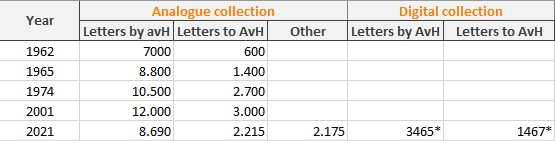

# The project
## About
### History
The project of reconstructing Alexander von Humboldt's correspondence began with the founding of an Alexander von Humboldt Commission at the *Deutsche Akademie der Wissenschaften zu Berlin* (German Academy of Sciences at Berlin) in 1956. In 1960, the Academies of Sciences in East and West Germany as well as the Austrian Academy of Sciences sent a joint request for international support of an edition of Humboldt's correspondence to academies, archives, librarires and collectors. Only two years later, copies of about 7,600 letters from all over the world had arrived in Berlin. 

Based on this constantly growing collection, the *Alexander-von-Humboldt-Forschungsstelle* (Alexander von Humboldt Resarch Center) began its work in 1970. From 1973 to 2014 a team of researchers published 42 volumes of correspondences, monographs and anthologies. Since 2015, a new project ["Travelling Humboldt - Science on the Move"](https://edition-humboldt.de/?&l=en) continues this long-term work in the spirit of digital humanities and prepares a digital and print edition of Alexander von Humboldt's travel journals and scientific manuscripts from his literary estate.

### About this project
This experimental project seeks to discover, explore and visualize the correspondence of Alexander von Humboldt. The idea started with the catalog of Alexander von Humboldt's letters held at the Berlin-Brandenburg Academy of Sciences (BBAW). Up to now, the collection is only accessible via an index card system established in the 1950s. Only the research aid has been digitally reproduced by Anne McKinney during her intership with the project. 

The original idea was to make at least a part of the collection digitally accessible and to discover it with the help of new research tools. With this goal in mind, the catalog was to be correlated with modern manuscript databases.

This project is a milestone and aims to evolve in the future with, for example, the development of a web interface for a better user experience and more accessible data.

## Data
The [Kalliope Verbund](https://kalliope-verbund.info/) is certainly the largest catalog of archives of partly German speaking institutions. The data of the letters sent and received by Alexander von Humboldt (AvH) have been retrieved from the Kalliope's API in Dublin Core format.

In order for this digital project to be representative of the years of work carried out by the BBAW, it was important to include data from outside Germany. It was initially agreed to use data from the [Bibliothèque nationale de France](https://catalogue.bnf.fr/index.do) (BnF), which offers a user-friendly API. The data of Alexander von Humboldt's correspondence preserved at the [Bibliothèque nationale de France](https://catalogue.bnf.fr/index.do) and accessible on the latter's online catalogue in csv format were then retrieved.

The institutions listed in the BBAW search help are far from being only European, the documents concerning AvH and kept at the [American Philosophical Society](https://www.amphilsoc.org/library/search-collections) were also retrieved, in EAD format.

### Quantity of letters
Based on calculations made in 1962, it was been estimated that Humboldt wrote up to 3,000 letters a year. Extrapolated, this resulted in an estimated total of 35,000 to 50,000 letters from Humboldt's hand; this estimate is still valid today ([Biermann and Lange 1962, p. 226](documentation/bibliography.md)). In the case of the letters received by Humboldt, most of which are now considered lost, Biermann and Lange assumed approximately 100,000 letters. 



_*This is the number of entries. This means that an entry can represent more than one letter. This is often the case for data from the BnF where one entry may represent several dozen documents._

The analogue collection part of this table was written by Ann McKinney. The works used to compile this table are listed in the [bibliography available in `documentation`](documentation/bibliography.md).

### Work on the data
All the data were cleaned and homogenised in order to be able to search in them. In order to visualise the letter on a map, new data were also added for each of the letters:
- geopoints, geoname ID and [humboldt digital edition](https://edition-humboldt.de/?&l=en) identifier (edh) ID for institution's place
- geopoints, geoname ID and edh ID for coverage place

## Repository structure
```
corresp-humboldt-dataviz
    ├── documentation/...
    ├── notebooks
    │      ├── data
    │      │    ├── edh_findbuch.json
    │      │    └── records.json
    │      ├──  utils
    │      │    ├── mapviz.py
    │      │    ├── prepare_data.py
    │      │    ├── search_by.py
    │      │    ├── search_dynamic.py
    │      │    ├── widgets.py
    │      │    └── women.py
    │      ├── mapviz.ipynb
    │      └── search.ipynb
    ├── .gitignore
    └── requirements.txt

```

## Tools used
In the absence of developing an entire website allowing for a thorough user experience, it was decided to start by using jupyter notebooks. These interactive and powerful notebooks have the advantage of offering numerous widget possibilities and data visualisations.
Several libraries were used for data visualisations, among them the main ones are:
- [ipywidgets](https://ipywidgets.readthedocs.io/en/latest/)
- [ipyleaflet](https://ipyleaflet.readthedocs.io/en/latest/)
- [matplotlib](https://matplotlib.org/)
- [pandas](https://pandas.pydata.org/)
- [numpy](https://numpy.org/)


# Discover the Alexander von Humboldt's correspondence
These guidelines are intended to assist the user in setting up the project on their local server. These commands lines can be used on a Linux system or Windows system with a [WSL](https://docs.microsoft.com/en-us/windows/wsl/install-win10).

## First launch 
Prerequisite: python3

*You can install it via this [site](https://www.python.org/downloads/). As a reminder: most Linux systems already have Python installed.*

1. Clone this git repository : `git clone https://github.com/edition-humboldt-collection/corresp-humboldt-dataviz.git` and go inside
2. Install a virtual environment : `virtualenv -p python3 env`
3. Activate the virtual environment via `source env/bin/activate`
4. Install `requirements.txt` : enter into the corresponding folder `corresp-humboldt-dataviz` and run the command `pip install -r requirements.txt`
5. Run the jupyter notebook with the command: `jupyter notebook`. The notebook should automatically launch in your browser.

## Launch
1. Go into the corresponding folder `corresp-humboldt-dataviz`
2. Activate the virtualenv : `source env/bin/activate`
3. Run the jupyter notebook with the command : `jupyter notebook`.

# Credits
Corresp-humboldt-dataviz is developed by [Axelle Lecroq](https://github.com/axellelecroq/), intern in the BBAW's project ["Travelling Humboldt - Science on the Move"](https://edition-humboldt.de/?&l=en), with the help of [Gordon Fischer](https://www.bbaw.de/die-akademie/mitarbeiterinnen-mitarbeiter/fischer-gordon) and under the supervision of [Dr. Ulrich Päßler](https://www.bbaw.de/die-akademie/mitarbeiterinnen-mitarbeiter/paessler-ulrich) and [Dr. Tobias Kraft](https://www.bbaw.de/die-akademie/mitarbeiterinnen-mitarbeiter/kraft-tobias).
The search aid for the analogue collection has been digitally reproduced by Anne McKinney.

This github repository is part of my master thesis work:
Axelle Lecroq, _Entre enrichissement et développement de projets : l’utilisation de données externes pour la correspondance d’Alexander von Humboldt_, sous la direction d´Ariane Pinche, École nationale des chartes (PSL), 2021.

# Bibliographie
You can find the bibliography [here](documentation/bibliography.md).


# Contacts
If you have any questions or remarks, please contact [axelle.lecroq[at]bbaw.de](mailto:axelle.lecroq@bbaw.de).
