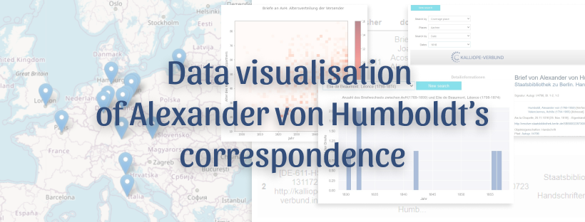

# The project
## About
This experimental project seeks to discover, explore and visualise the correspondence of Alexander von Humboldt. It is the result of the first part of a four-month internship within the BBAW's project ["Travelling Humboldt - Science on the Move"](https://edition-humboldt.de/?&l=en), a digital edition of Alexander von Humboldt's travel journals and correspondence.

The idea started with the analogous collection of Alexander von Humboldt's letters held at the BBAW. Decades ago, the academy sought to catalogue the scientist's correspondence. They have preserved many copies as well as original letters. All these letters are still kept in a similar way with an old archiving system. Only the research aid has been digitally reproduced. 

The original idea was initially to reconstruct at least part of this collection and to discover it with new possibilities. 

## Structure of the repository
```
corresp-humboldt-dataviz
    ├── data
    │   ├── edh_findbuch.json
    │   ├── records.json
    ├── documentation/...
    ├── notebooks
    │   ├── mapviz.ipynb
    │   └── search.ipynb
    ├── routes
    │   ├── mapviz.py
    │   ├── prepare_data.py
    │   ├── search_by.py
    │   ├── search_dynamic.py
    │   ├── widgets.py
    │   └── women.py.ipynb
    ├── .gitignore
    └── requirements.txt

```
## Data
The [Kalliope Verbund](https://kalliope-verbund.info/) is certainly the largest catalogue of archives of partly German speaking institutions. The data of the letters sent and received by Alexander von Humboldt (AvH) have been retrieved from the Kalliope's API in Dublin Core format.
The data of Alexander von Humboldt's correspondence preserved at the [Bibliothèque nationale de France](https://catalogue.bnf.fr/index.do) and accessible on the latter's online catalogue in csv format were then retrieved.
The institutions listed in the BBAW search help are far from being only European, the documents concerning AvH and kept at the [American Philosophical Society](https://www.amphilsoc.org/library/search-collections) were also retrieved, in EAD format.

## Work on the data
All the data were cleaned and homogenised in order to be able to search in them. In addition, new data were also added for each of the letters:
- geopoints, geoname ID and [humboldt digital edition](https://edition-humboldt.de/?&l=en) identifier (edh) ID for institution's place
- geopoints, geoname ID and edh ID for coverage place

## Used tools
In the absence of developing an entire website allowing for a thorough user experience, it was decided to start by using jupyter notebooks. These interactive and powerful notebooks have the advantage of offering numerous widget possibilities and data visualisations.
Several libraries were used for data visualisations, among them the main ones are:
- ipywidgets for widgets in the jupyter notebook
- matplotlib for histograms
- ipyleaflet for map visualisations


# Discover the Alexander von Humboldt's correspondance
## First launch
Prerequisite: python3

*You can install it via this [site](https://www.python.org/downloads/). As a reminder: most Linux systems already have Python installed.*

1. Clone this git repository : `git clone https://github.com/axellelecroq/pantheonisees.git` et rentrer dedans
2. Install a virtual environment : `virtualenv -p python3 env`
3. Activate the virtual environment via `source env/bin/activate`
4. Install `requirements.txt` : enter into the corresponding folder `corresp-humboldt-dataviz` and run the command `pip install -r requirements.txt`
5. Run the jupyter notebook with the command: `jupyter notebook`. The notebook should automatically launch in your browser.

## Launch
1. Go into the corresponding folder `corresp-humboldt-dataviz`
2. Activate the virtualenv : `source env/bin/activate`
3. Run the jupyter notebook with the command : `jupyter notebook`.


